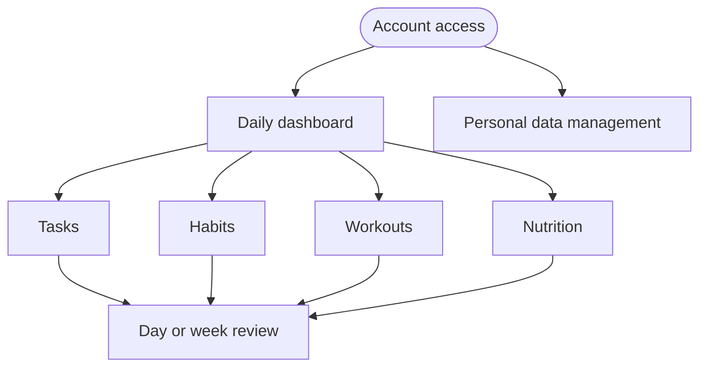
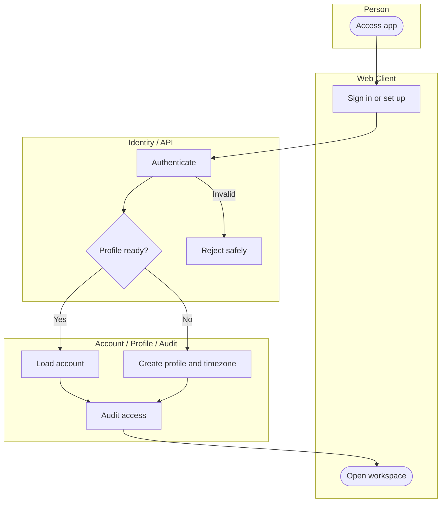
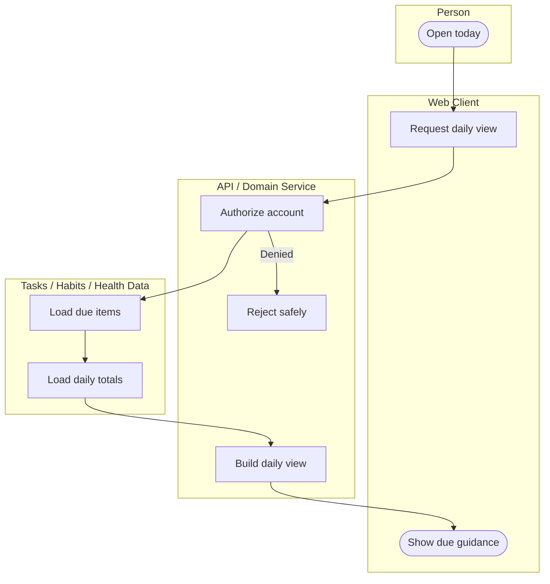
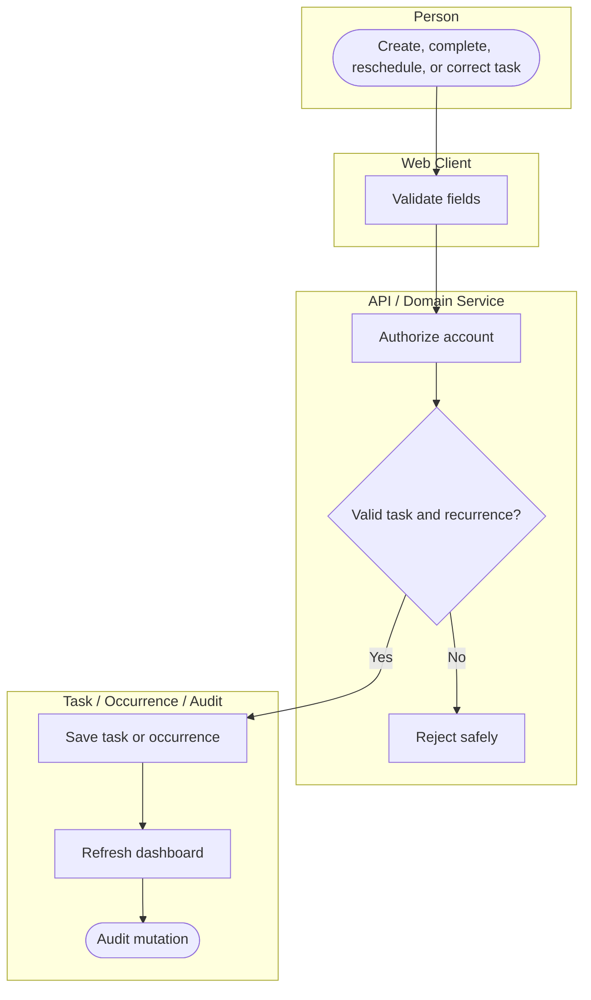
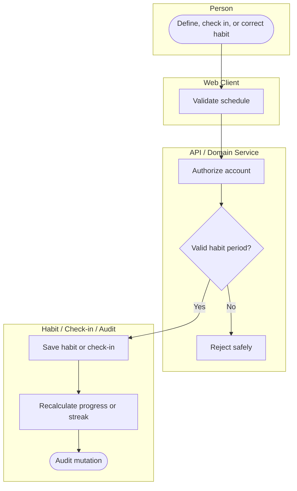
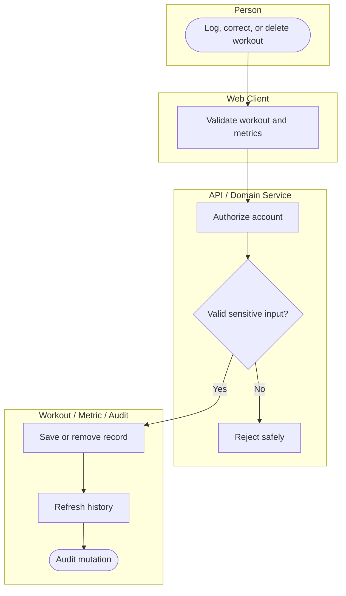
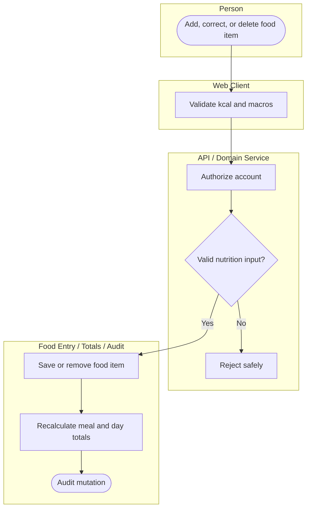
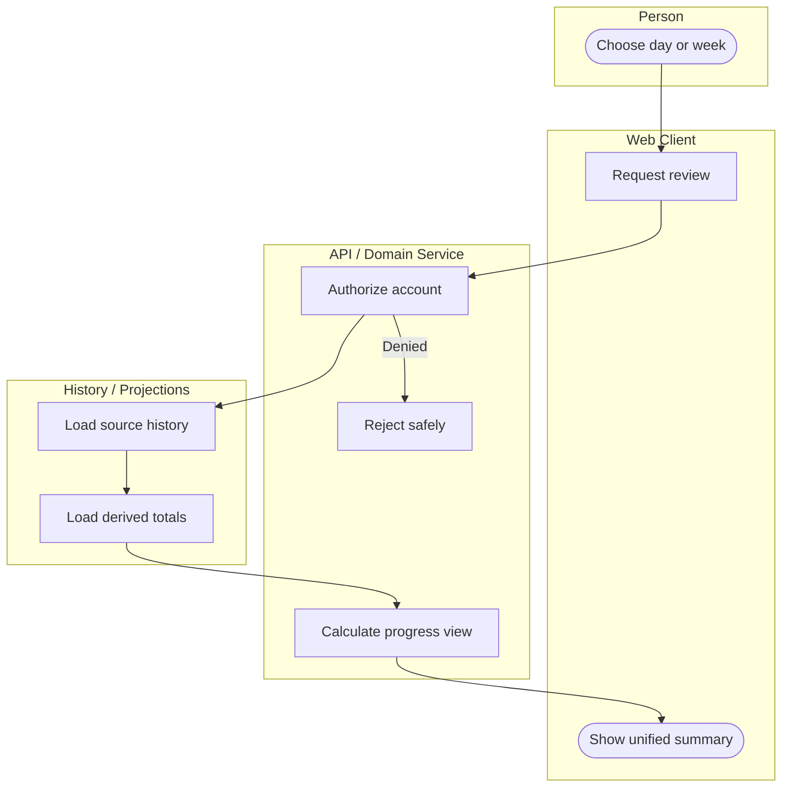
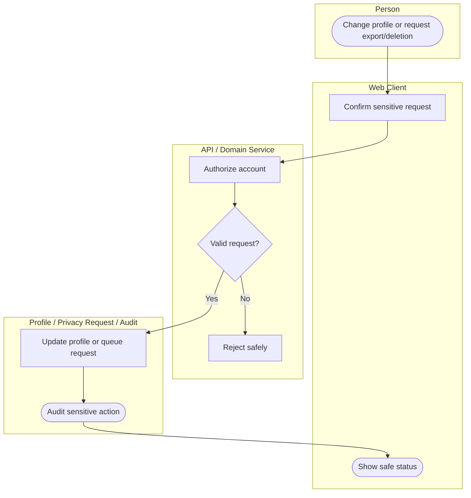

# Business Flow Catalog

**Status:** First-release activity-flow analysis for the personal productivity and wellbeing tracker.
**Authority:** This catalog explains ownership and handoffs. [PRD.md](PRD.md) is authoritative for product intent; [ARCHITECTURE.md](ARCHITECTURE.md) is authoritative for system controls; the runbooks remain authoritative for incident and release procedures.
**Compatibility:** All diagrams use standard Mermaid `flowchart TB` syntax with top-level subgraphs as swimlane-style ownership groups. They render in the current repository previewer.

## 1. Coverage and reading rules

- One personal account holder owns all release-one records. There are no shared workspaces or administrator flows.
- Every flow enforces the current account before a protected read or write. A safe rejection ends the flow without revealing another account's data.
- Each diagram shows one happy path and one meaningful rejection path. Detailed UI loading, empty, error, success, and unauthorized states are required by [UI_UX.md](UI_UX.md).
- Dates, recurrence, daily totals, habit progress, and review windows use the stored profile timezone.
- Fitness, nutrition, kcal, macro, and user-defined metric values are sensitive personal data. Diagrams name audit events but never include sensitive payloads.
- Incident and release/rollback procedures are operational, not product journeys. Follow [Incident Response](runbooks/INCIDENT_RESPONSE.md) and [Release and Rollback](runbooks/RELEASE_ROLLBACK.md) instead of duplicating them here.

## 2. Capability map

## 3. Flow analysis register

| ID | Journey and trigger | Authorization and data changed | Audit and exit | Exception | PRD |
| --- | --- | --- | --- | --- | --- |
| BF-01 | Access the app or complete first-time setup | Current identity; account/profile with timezone | Authentication outcome; workspace opens | Invalid identity or session is safely rejected | FR-001 |
| BF-02 | Open today’s view | Current account; dashboard projection reads due items and daily totals | Protected dashboard read; daily guidance appears | Unauthorized or unavailable data is safely rejected | FR-002 |
| BF-03 | Create, complete, reschedule, or correct a task | Current account; task and scheduled occurrence | Task mutation; dashboard projection refreshes | Invalid input or recurrence is safely rejected | FR-003 |
| BF-04 | Define, check in, or correct a habit | Current account; habit and check-in | Habit mutation; progress/streak recalculates | Invalid schedule or input is safely rejected | FR-004 |
| BF-05 | Log, correct, or delete a workout/metric | Current account; workout and optional metric | Sensitive personal-data mutation; history recalculates | Invalid metric/input is safely rejected | FR-005 |
| BF-06 | Add, correct, or delete a food item | Current account; food entry and meal/day nutrition total | Sensitive personal-data mutation; aggregates recalculate | Invalid kcal/macro input is safely rejected | FR-006 |
| BF-07 | Review a day or week | Current account; historical records and derived summaries | Protected review read; unified summary appears | Unauthorized or unavailable data is safely rejected | FR-007 |
| BF-08 | Change profile or request export/deletion | Current account; profile or queued privacy request | Sensitive-action audit; safe request status appears | Invalid or unauthorized request is safely rejected | FR-008 |

## 4. Conceptual ownership and history policy

| Concept | Owner and purpose | Derived or audit behavior |
| --- | --- | --- |
| Account and profile | Stores the account boundary, preferences, and timezone. | Authentication and profile/export/deletion requests create minimal audit records. |
| Task and scheduled occurrence | Stores a task’s due date, simple recurrence, and the occurrence acted upon. | Dashboard due items refresh after accepted changes. |
| Habit and check-in | Stores the configured habit and dated completion record. | Progress/streak is recalculated from the schedule and check-ins. |
| Workout and metric | Stores manual workout records and optional user-defined fitness metrics. | Daily/weekly history refreshes after accepted correction or deletion. |
| Food entry and nutrition total | Stores each manually entered food item and its kcal/macros. | Meal/day totals are derived from current entries, not independently edited. |
| Dashboard projection | Provides account-scoped due items and daily progress. | It is rebuilt or refreshed from source records after accepted changes. |
| Minimal audit event | Records actor, time, action, target type/identifier, outcome, and correlation ID. | It never contains workout, metric, food, kcal, macro, or other sensitive payloads. |

Users may correct or delete their own historical task, habit, workout, metric, and food records. The system recalculates the affected occurrence, totals, streak/progress, dashboard, and review projection, then records only the minimal audit event.

## 5. BF-01 — Account access and first-time setup

## 6. BF-02 — Daily dashboard and in-app guidance

## 7. BF-03 — Task lifecycle

## 8. BF-04 — Habit setup and check-in

## 9. BF-05 — Workout and fitness metric logging

## 10. BF-06 — Food item and macro logging

## 11. BF-07 — Day and week review

## 12. BF-08 — Personal data management

